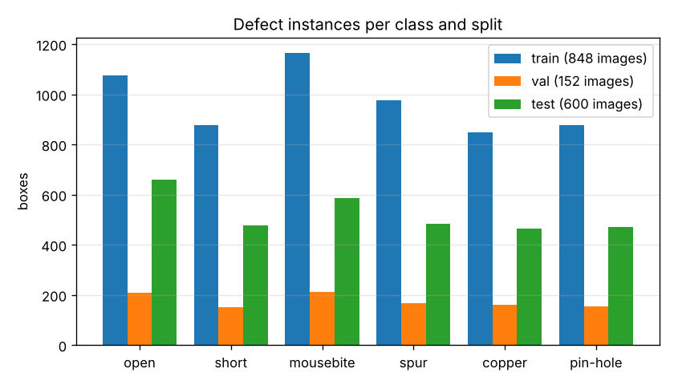
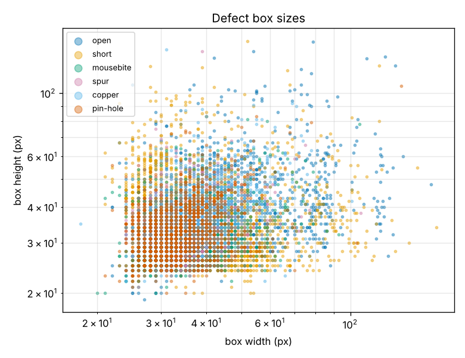
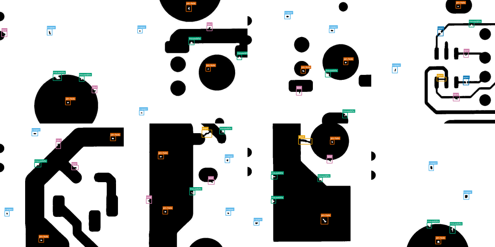

# Dataset card: DeepPCB (curated)

> Generated by `prepare_detection.py --dataset deeppcb` and copied here, because `data/` is not
> committed. Regenerate with `bash reproduce_det.sh` (step 1). Why this dataset and how it
> maps to semiconductor FA: [../DETECTION.md](../DETECTION.md#1-dataset).

## Provenance

| | |
|---|---|
| source | DeepPCB, Tang et al. 2019, "Online PCB Defect Detector on a New PCB Defect Dataset", arXiv:1902.06197 |
| licence | MIT (research use), see github.com/tangsanli5201/DeepPCB |
| acquisition | linear-scan CCD, ~48 px/mm, ~16k×16k board images cut into 640×640 tiles, binarised, aligned to a defect-free template by template matching |
| annotation | axis-aligned boxes + class, 3-12 defects per image (some defects are artificially added, per the paper) |
| classes | 0 open, 1 short, 2 mousebite, 3 spur, 4 copper (spurious copper), 5 pin-hole |

## Curation steps

1. Official 1,000 trainval / 500 test split kept; 15% of trainval → val, stratified by board group (seed 42).
2. 100 defect-free templates from test boards added to test as clean controls (`*_clean`, no boxes).
3. Boxes clipped to the image, corners ordered, boxes < 2 px dropped; class ids shifted to 0-based.
4. Images stored as 8-bit grayscale PNG; template stored under `references/` with the same id.
5. Preprocessing views (`gray`, `refdiff`) written under `views/` with an Ultralytics `data.yaml`; labels are symlinked, not copied.

## Known limitations

- PCB, not silicon: binarised images, so no grey-level texture, charging, or SEM noise.
- Some defects are synthetic (added by the dataset authors), so they may be more regular than real ones.
- References are near-perfectly aligned; real die-to-die comparison has registration error (see the
  misalignment discussion in TECHNICAL_ANALYSIS.md).
- Only defect-containing images in the original data; the clean controls are templates, which are
  cleaner than a real good board would be.

Source: DeepPCB (github.com/tangsanli5201/DeepPCB, MIT, research use)

Generated by `prepare_detection.py`. Images: 1600. Image sizes: 640x640 (1600).

## Splits

| split | images | boxes | images without defects | boxes/image (mean, min-max) |
|---|---|---|---|---|
| train | 848 | 5817 | 0 | 6.9 (1-15) |
| val | 152 | 1056 | 0 | 6.9 (3-12) |
| test | 600 | 3140 | 100 | 5.2 (0-13) |

## Class distribution (boxes)

| class | train | val | test | total | share |
|---|---|---|---|---|---|
| open | 1075 | 208 | 659 | 1942 | 19.4% |
| short | 876 | 152 | 478 | 1506 | 15.0% |
| mousebite | 1166 | 213 | 586 | 1965 | 19.6% |
| spur | 975 | 167 | 483 | 1625 | 16.2% |
| copper | 849 | 161 | 464 | 1474 | 14.7% |
| pin-hole | 876 | 155 | 470 | 1501 | 15.0% |

## Box sizes (pixels)

| class | median w x h | area p5 / median / p95 | median aspect w/h |
|---|---|---|---|
| open | 38 x 34 | 858 / 1320 / 4235 | 1.13 |
| short | 41 x 36 | 938 / 1487 / 3655 | 1.19 |
| mousebite | 34 x 30 | 700 / 1024 / 1900 | 1.14 |
| spur | 34 x 32 | 800 / 1080 / 1927 | 1.07 |
| copper | 36 x 36 | 784 / 1292 / 2600 | 1.00 |
| pin-hole | 33 x 32 | 702 / 1085 / 2050 | 1.03 |

